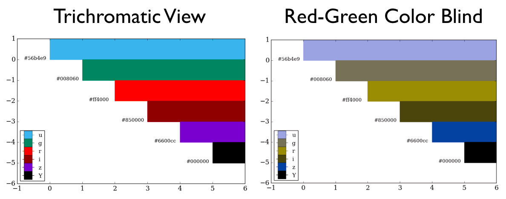

# DES Colors

[](https://travis-ci.org/kadrlica/descolors)
[](https://pypi.python.org/pypi/descolors)
[](../../releases)
[](../../)

Standard color scheme for DES.

# Installation

The easiest way to install is with `pip`:
```
pip install descolors
```

# Usage

See the example in [`des_colors.ipynb`](examples/des_colors.ipynb).


